在此示例中，我们将连接 MQTT 服务器。根据您的设备类型（Modbus RTU/TCP、西门子 S7 协议、OPC-UA、BACnet IP、MQTT 或 Ethernet/IP），选择适当的连接类型。

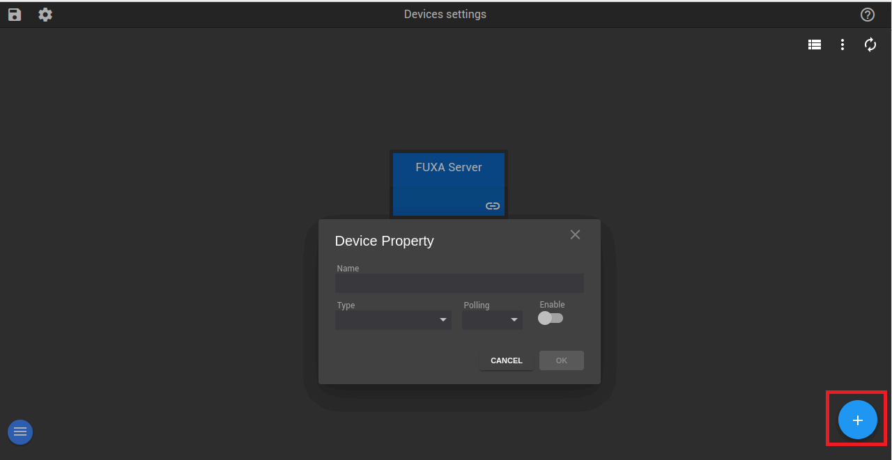

选择设备类型，将轮询间隔设置为您所需的秒数，并启用它。然后，向服务器提供必要的凭据，包括地址、客户端 ID、用户名和密码。

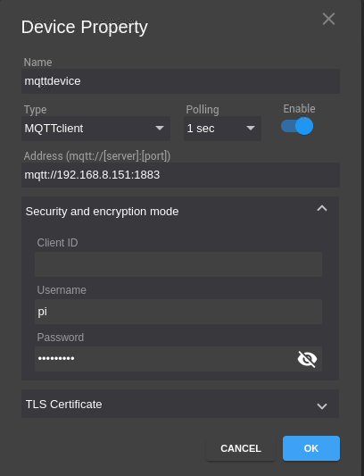

选择标签
步骤 1

接下来，您将看到一个绿色指示器，确认成功连接到 MQTT 服务器。随后，点击附加图标。

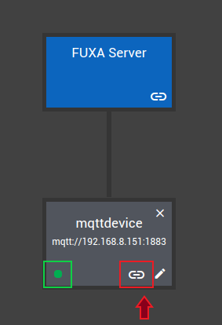

步骤 2

点击"+"图标添加 MQTT 代理。订阅相关主题，然后点击搜索图标继续。

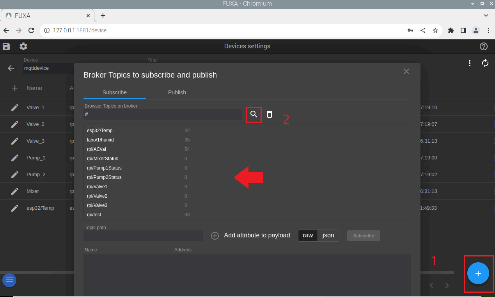

步骤 3

接下来，从列表中选择要订阅的主题。提供一个名称并点击"订阅"。您可以灵活地添加多个主题进行订阅。

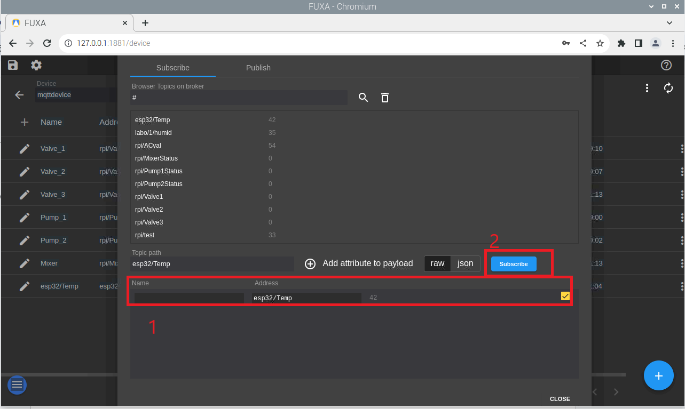

要发布主题，您需要指定它。提供一个用于识别的名称并指定主题。

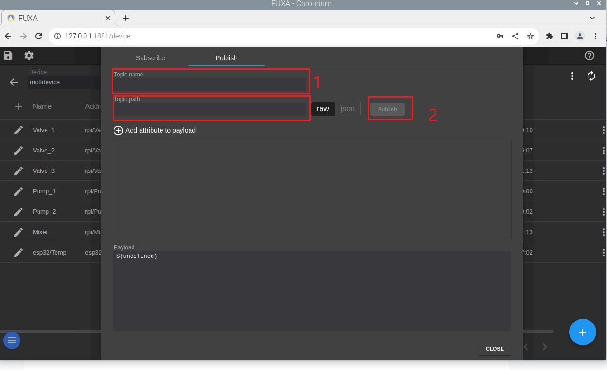

之后，您将有一个主题列表，允许您选择是发布还是订阅。

使用滑块调整发送到终端设备的值
在此示例中，我们将控制器绑定到设备标签。控制选项卡提供各种输入值的功能，在这种情况下，我们将使用滑块。滑块可以根据您的具体要求进行自定义。

显示设备数据
在您的系统中，可能需要展示传感器数值。为此，您可以使用圆形仪表、条形仪表等工具。在本演示中，我们将使用圆形仪表，它可以在控件选项卡下找到。

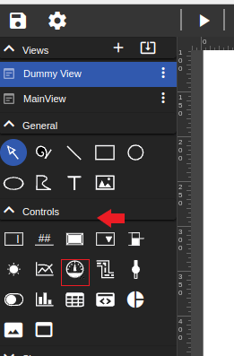

接下来，您将看到一个交互式用户界面来修改您的圆形仪表。选择标签并根据您的偏好进行自定义。您可以选择将其分为子区间，为这些区间分配颜色，甚至更改文本位置等其他自定义功能。

添加过程工程组件
在本节中，您将发现丰富的过程工程组件，如泵、电机、鼓风机、储罐、混合器等。在我们的演示中，我们将重点设置泵的开启和关闭颜色。只需选择相关标签并指定开启和关闭状态的颜色。

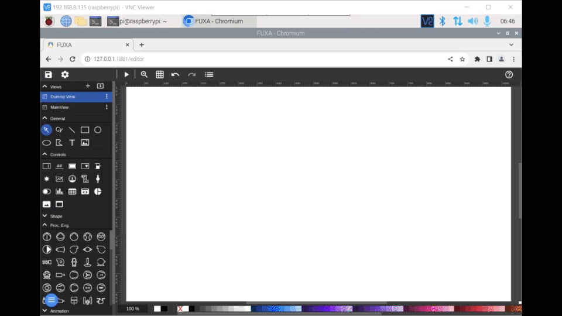

如何制作管道动画
首先设计您的管道形状，然后通过将设备标签（变量）与动画绑定来定义动作。

如何添加图表
要向视图添加图表控件，请进入编辑器并选择视图。

如何添加报警
要添加报警，您需要导航到编辑器窗口中的设置并选择报警。

接下来，有几个设置报警的选项：高高、高、低和消息。在高高中，我们可以设置阈值并配置报警。在高中，当数值超过某个范围时，我们可以在两个临界点之间设置报警。消息是当数值达到某个阈值时弹出并消失的通知。低在传感器数据低于某个水平时触发，例如，当储罐液位较低时。在这种情况下，我们也可以为两个临界设定点设置报警。在本示例中，我们将演示高高和消息报警的功能运行现象。

要查看报警，您可能需要稍微调整布局，因为它默认是隐藏的。为此，请转到布局并导航到标题导航栏。

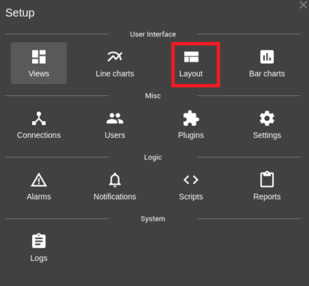

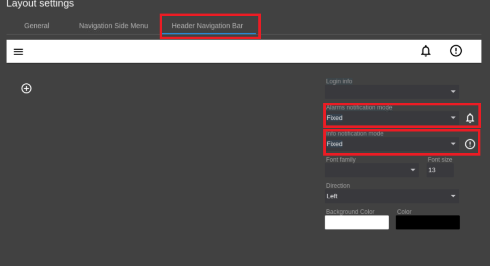

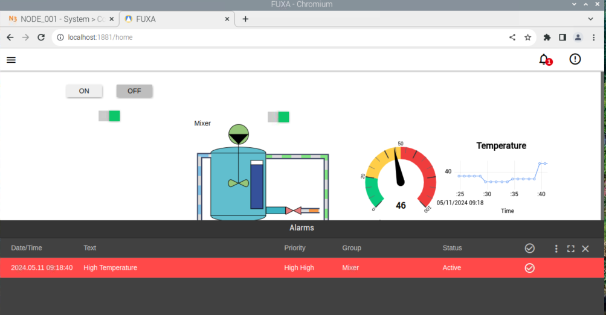

然后，确保报警通知模式设置为固定，信息通知模式也设置为固定。此配置允许您在操作SCADA系统时查看报警通知。

演示
在这个综合演示中，设置包括三个储罐，其中两个储罐装有各种溶液。此外，还有两个独立的阀门和泵将溶液转移到混合罐中。混合过程完成后，有一个单独的阀门用于获取最终溶液。在整个操作过程中，混合罐的温度会被持续监控。

