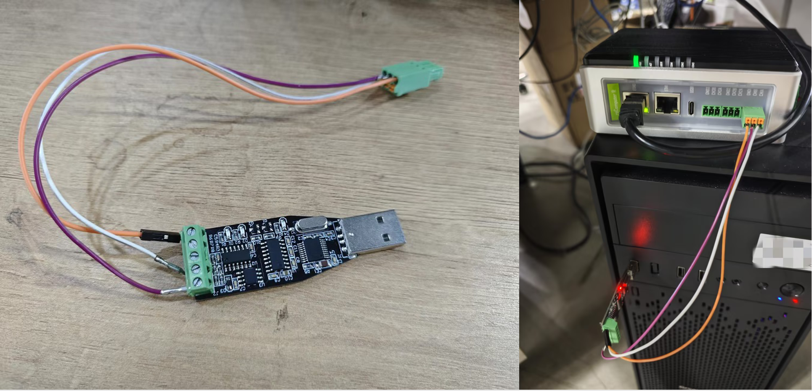
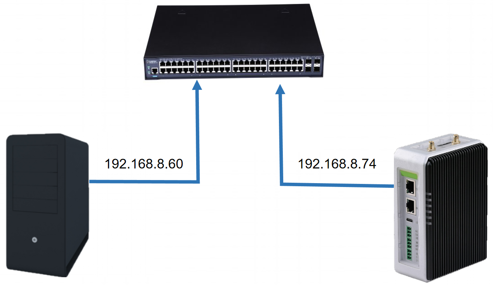
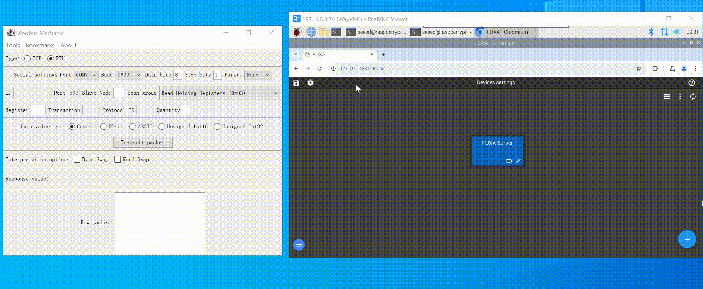
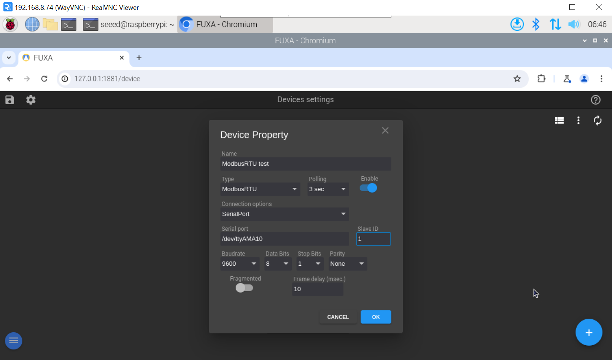
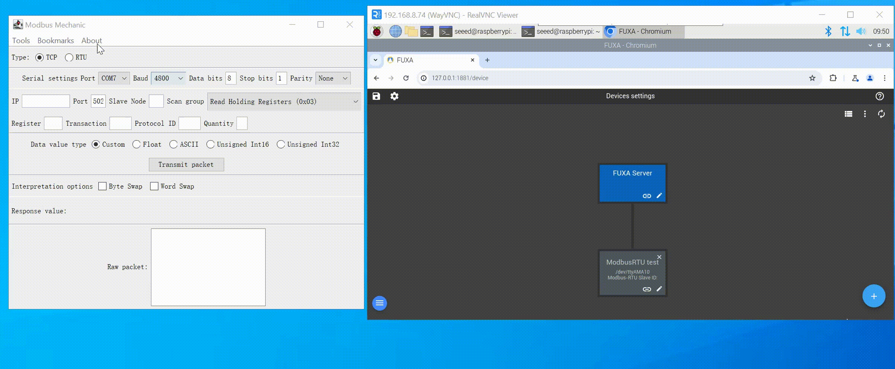
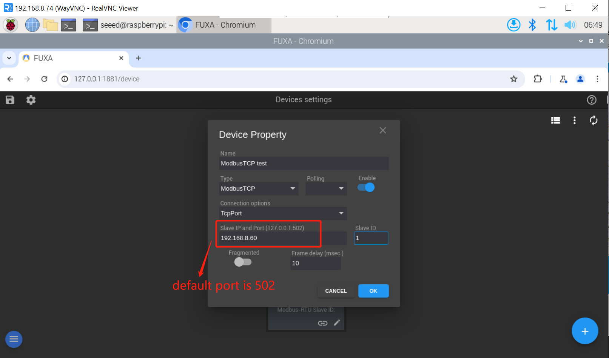

# 使用 FUXA 进行 Modbus RTU/TCP 通信

## 硬件配置

对于 Modbus RTU，我们使用了一个 RS485 转 USB 模块来连接 reComputer R1000 与 W10 电脑。

对于 Modbus TCP，我们使用以太网线将 W10 电脑和 reComputer R1000 连接到交换机，以确保它们在同一网段内。

## Modbus RTU 通信步骤

### 步骤 1：配置 Modbus 从站

在 Win10 电脑上打开 ModbusMechanic，选择相应的串口和波特率，然后点击右上角的 Tools，选择 Start Slave Simulator，然后选择 RTU，输入 slave ID，然后您可以设置从机的数据字段，我们添加了三个线圈和一个 Holding Register，供后续从 Modbus 主机读取。

### 步骤 2：在 FUXA 中添加 Modbus RTU 设备

在 FUXA 中，点击右下角的 + 按钮，输入模块名称，Type 选择 Modbus RTU，Connection options 选择 SerialPort，然后选择您需要使用的串口号并设置相应的波特率和其他参数，最后点击 OK。

### 步骤 3：配置数据标签

之后，我们进入 Devices settings 页面，点击左上角的 + 按钮来设置我们需要读取的数据字段。我们设置相应的参数并点击 OK，可以看到 FUXA 已经成功获取了 Modbus 从机数据。

## Modbus TCP 通信步骤

### 步骤 1：配置 Modbus 从站

在 Win10 电脑中打开 ModbusMechanic，然后点击右上角的 Tools，选择 Start Slave Simulator，然后选择 TCP，输入 slave ID，您可以设置从机的数据字段。我们添加了两个线圈和一个 holding register，供后续从 Modbus 主机读取。

### 步骤 2：在 FUXA 中添加 Modbus TCP 设备

点击 FUXA 右下角的 + 按钮，输入模块名称，Type 选择 Modbus TCP，Connection options 选择 TcpPort，Slave IP and port 选择从机的 IP 地址，默认端口号为 502，然后输入 Slave ID，最后点击 OK。

### 步骤 3：配置数据标签

之后，我们进入 Devices settings 页面，点击左上角的 + 按钮来设置我们需要读取的数据字段。我们设置相应的参数并点击 OK，可以看到 FUXA 已经成功获取了 Modbus 从机数据。

## 总结

通过以上步骤，您已经学会了如何在 FUXA 中配置 Modbus RTU 和 Modbus TCP 通信。这两种通信方式各有优势：

- **Modbus RTU**：适用于串行通信，使用 RS485 接口，适合短距离、多设备连接的场景
- **Modbus TCP**：基于以太网通信，适合长距离、高速传输的场景

选择哪种通信方式取决于您的具体应用场景和硬件配置。FUXA 提供了灵活的配置选项，使您能够轻松实现与各种 Modbus 设备的通信。
