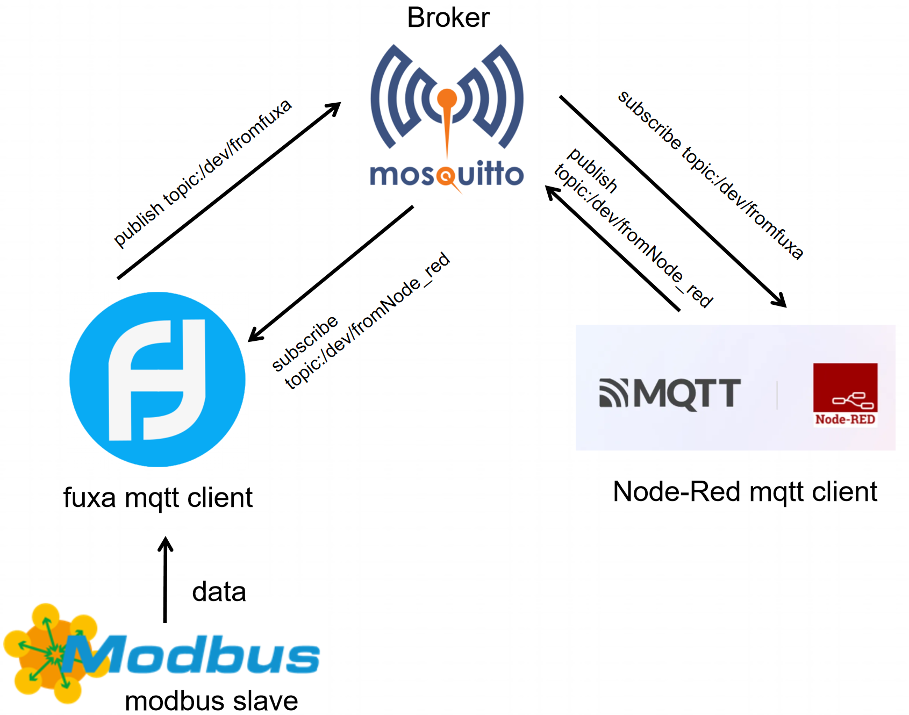
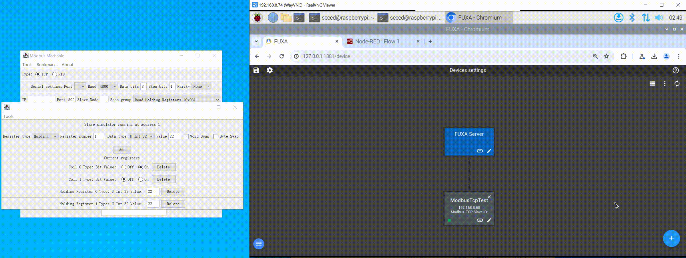
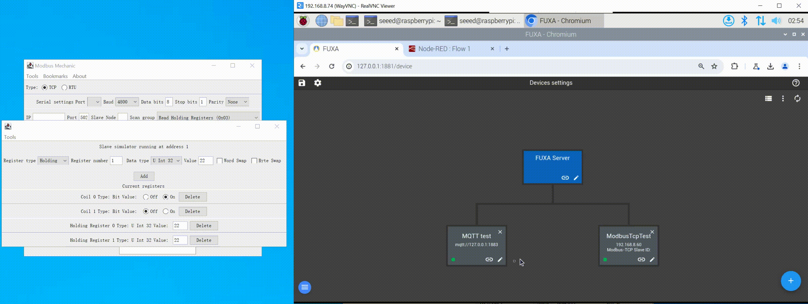
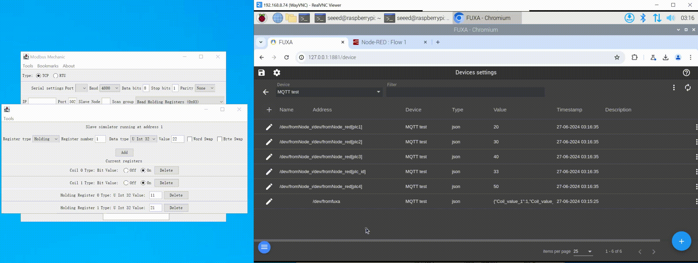

# 使用 FUXA 作为 MQTT 客户端

本文主要介绍如何在 reComputer R1000 上使用 FUXA 进行 MQTT 通信。本文使用 mosquitto 作为 MQTT 服务器代理，FUXA 和 Node-RED 作为 MQTT 客户端，并引入一个 Modbus TCP 从站作为 FUXA 发布数据的来源。FUXA 订阅名为 /dev/fromNode_red 的主题并发布名为 /dev/fromfuxa 的主题。该主题的数据来自 Modbus TCP 从站；Node-RED 订阅名为 /dev/fromfuxa 的主题并发布 /dev/fromNode_red 主题。通信框架如图所示：

## 硬件准备

| reComputer R1000 |
|-----------------|

 |

## 硬件配置

对于 Modbus TCP，我们使用以太网线将 W10 PC 和 reComputer R1000 连接到交换机，以确保它们在同一网段内。

## MQTT 客户端通信步骤

### 步骤 1：建立连接和部署服务

参考这个教程，使用 FUXA 与 modbusmechanic 建立连接。并参考这个 wiki 在 reComputer R1000 上部署 mosquitto 和 Node-RED。

### 步骤 2：连接到 MQTT 服务器

点击 FUXA 界面右下角的 + 按钮，输入 Name、Type，选择 MQTTclient，然后输入 MQTT 服务器的 IP 地址和端口号。如果您的 MQTT 服务器需要安全验证，您还需要输入 Client ID、Username、Password 等。我们的服务器不需要此验证，因此不填写。最后点击 OK 并等待模块左下角出现绿点，表示成功连接到 MQTT 服务器。

### 步骤 3：订阅主题

进入配置界面，点击左上角的 + 按钮，在 Browser Topics on broker 中输入要订阅的主题，这里我们订阅 Node-RED 发布的 /dev/fromNode_red 主题，然后点击旁边的搜索按钮，可以看到相应主题的内容。FUXA 支持两种显示格式：raw 和 json。这里我们选择 json，最后点击 subscribe 即可成功订阅。

### 步骤 4：发布主题

进入配置界面，选择 Publish 栏，在 Topic path 中输入要发布的主题名称，这里我们输入 /dev/fromfuxa，然后点击 Add attribute to payload，会弹出一行可以发布的数据内容，这里我们选择从 Modbus TCP 从站获得的 4 个数据和一个时间戳作为我们发布主题的内容，选择发布格式为 json，最后点击 Publish 即可成功发布。

### 步骤 5：验证数据传输

完成上述配置后，我们在 Modbus 从站侧更改数据。您可以在 Node-RED 的调试窗口中看到数据的实时变化，表明 FUXA 成功通过 /dev/fromfuxa 主题将数据发布出来。

