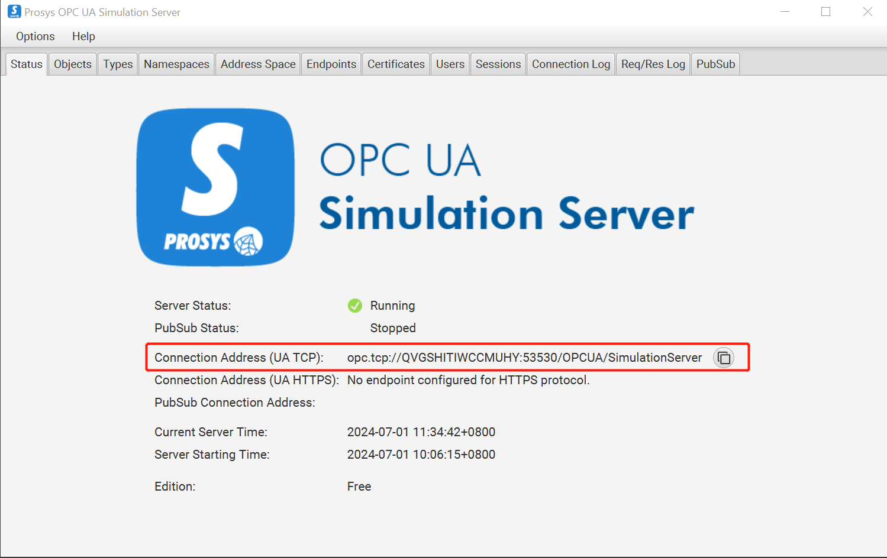
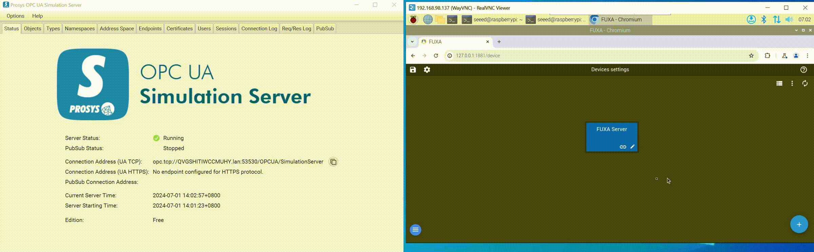
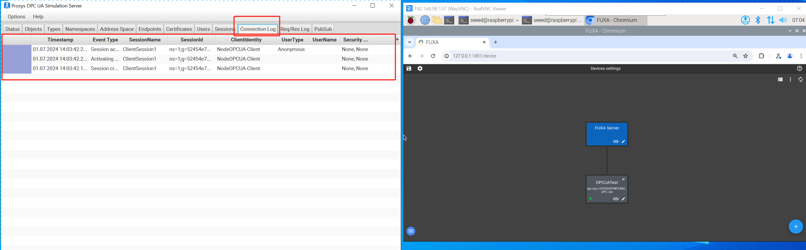
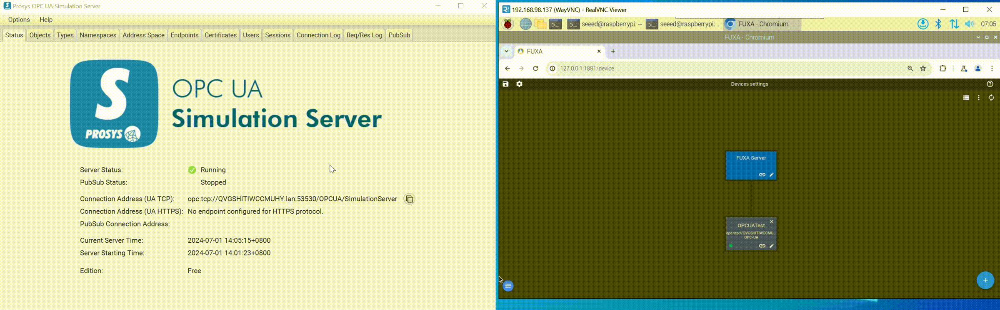

# 使用 FUXA 进行 OPC-UA 通信

本文主要介绍如何使用 FUXA 进行 OPC-UA 通信。我们在 W10 PC 上运行 Prosys OPC UA Simulation Server，然后在 reComputer R1000 上读取模拟器的数据。

## 硬件准备

| reComputer R1000 |
|-----------------|

 |

## 硬件配置

我们使用以太网电缆将 W10 PC 和 reComputer R1000 连接到交换机，以确保它们在同一网段内。

## OPC-UA 通信步骤

### 步骤 1：打开 Prosys OPC UA Simulation Server

打开 Prosys OPC UA Simulation Server 并复制 Connection Address(UA TCP)。

### 步骤 2：连接到 OPC-UA 服务器

点击右下角的 + 按钮，输入 Name，Type 选择 OPCUA，将第一步复制的 Connection Address(UA TCP) 粘贴到 Address，Security and encryption mode 根据您自己的设备要求选择。这里我选择 None-None。如果您的设备在建立连接时需要 Username 和 Password，您可以在相应的地方填写。最后点击 OK。打开 Prosys OPC UA Simulation Server 的 ConnectionLog，出现如图所示的日志，表示连接成功建立。

### 步骤 3：创建标签来显示数据

进入配置界面，点击左上角或右下角的 + 按钮，您可以看到三个标签 Objects、Type、Views，点击 Objects，然后点击 Simulation 查看模拟器模拟的数据，我们选择 Simulation 下的所有数据并创建标签。最后，点击 OK。您可以看到我们可以尝试读取 OPCUA 设备的数据。

